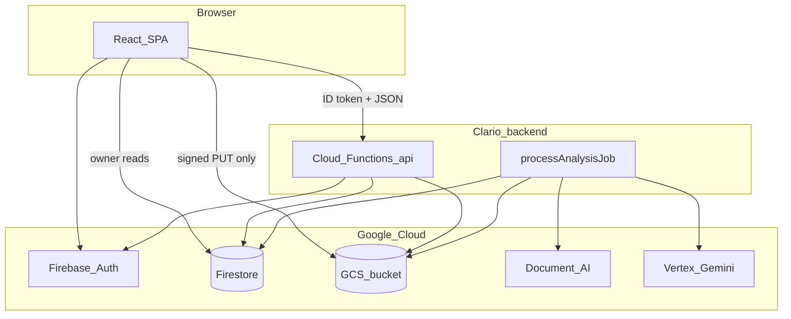
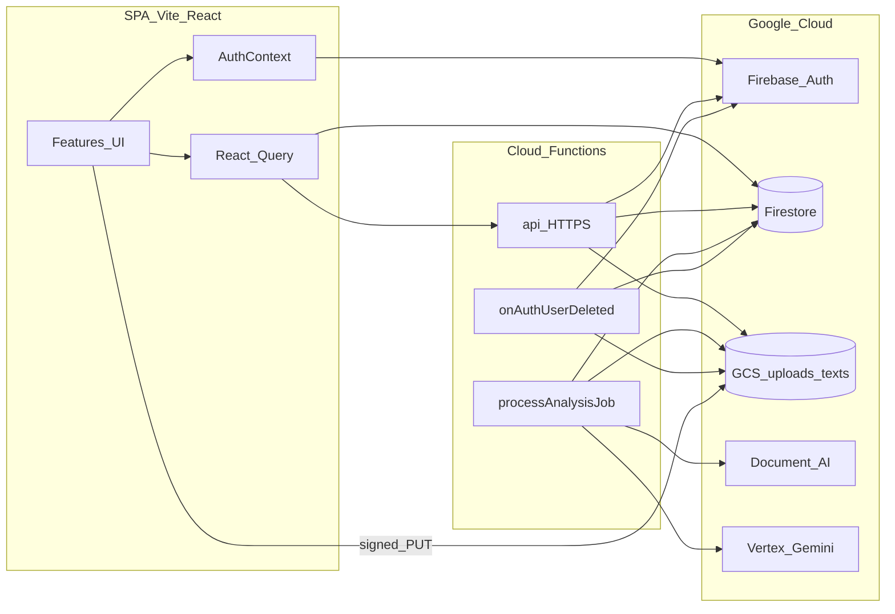
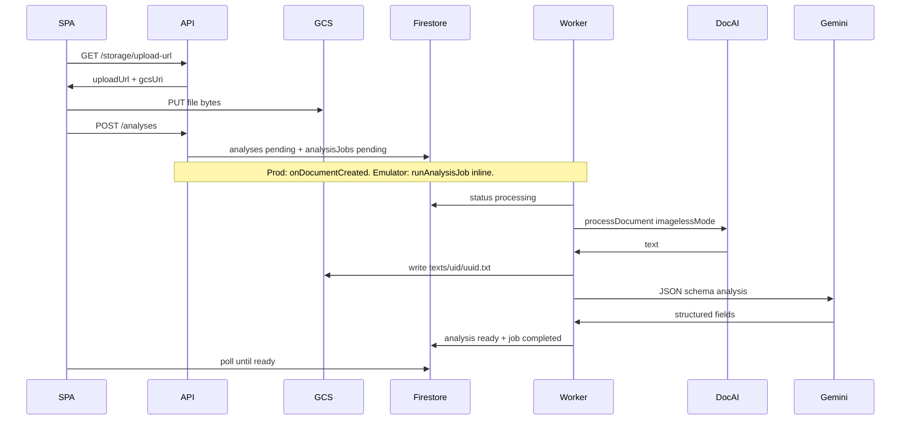
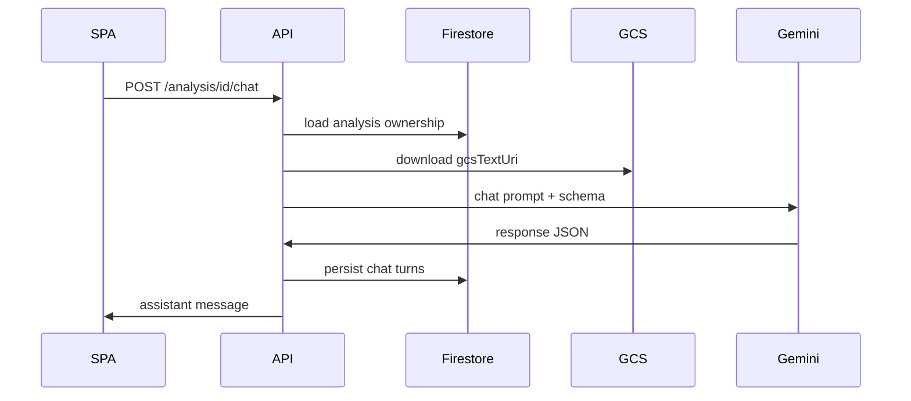
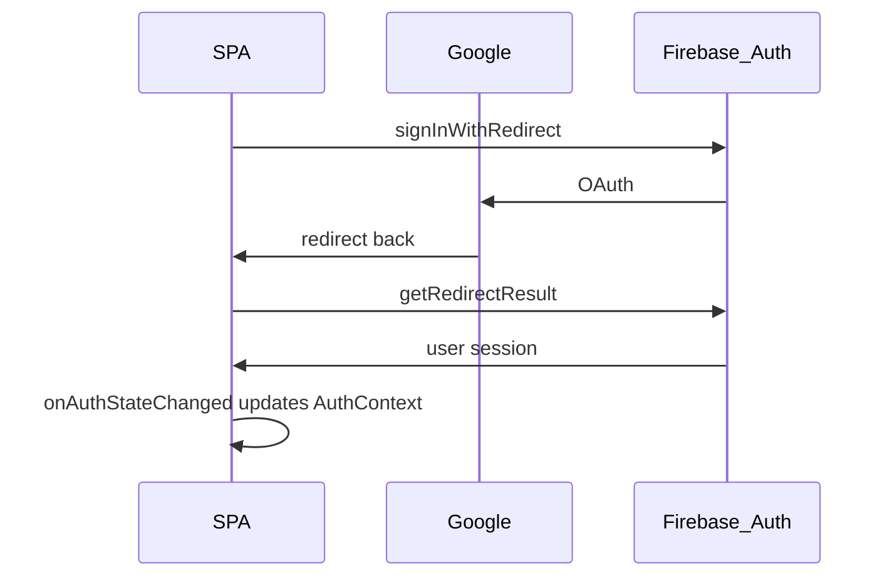
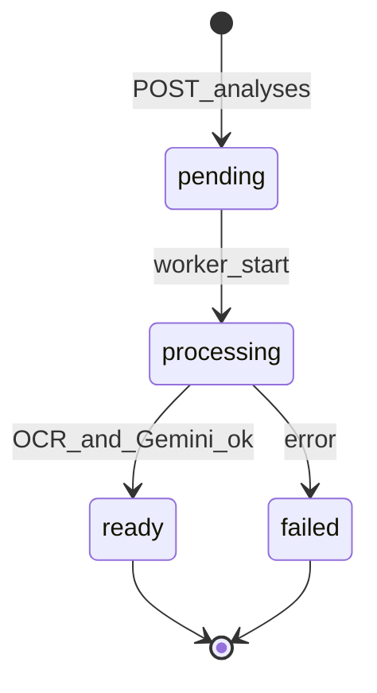

# Clario System Design

Clario is an AI legal-document analyzer. A React SPA authenticates with Firebase Auth, talks to a Cloud Functions BFF for mutations, and reads owner-scoped Firestore documents for results and quota. The BFF orchestrates GCS uploads (signed URLs), Document AI OCR, Vertex Gemini structured analysis, and async job state.

This document is the **single source of truth** for architecture. Do not put real API keys, service-account JSON, private keys, or machine-local paths in this file or in git.

---

## 1. Context and goals

### 1.1 Product

- Upload a contract (PDF, DOCX, or TXT, max 10 MB).
- Extract text (Document AI for PDFs; processor-dependent for other types).
- Produce structured analysis (summary, fields, risks, completion score) via Gemini.
- Chat about a finished analysis and run party-scoped negotiation helpers.
- Enforce free-tier quota server-side.

### 1.2 Trust boundaries



| Zone | May hold | Must not hold |
|------|----------|---------------|
| Browser | Firebase web config (`VITE_*`), user ID token, analysis JSON the user owns | Service-account private keys, Document AI admin credentials |
| BFF / worker | Admin SDK, GCS signing (runtime SA / ADC), Vertex + Document AI clients | Browser-origin secrets in source |
| Git | Placeholder env examples, architecture docs | `.env`, `service-account*.json`, embedded `BEGIN PRIVATE KEY` |

---

## 2. High-level architecture



| Layer | Responsibility |
|-------|----------------|
| SPA (`src/`) | Auth UX, upload, progress, dashboard, results, chat/negotiation UI |
| BFF (`functions` `api`) | AuthZ, rate limit, quota, signed URLs, job enqueue, chat/negotiation by `analysisId`, delete |
| Worker (`processAnalysisJob`) | OCR → Gemini → mark analysis `ready` / `failed` |
| Cascade (`onAuthUserDeleted`) | Admin Auth user delete → wipe user data + GCS prefixes |
| Firestore | Users, analyses, jobs, chat turns, negotiation state, rate limits |
| GCS | Original uploads + extracted text objects |

---

## 3. Repository layout

```
/
├── src/                     # Browser app only
│   ├── app/                 # App shell, providers, routes
│   ├── features/
│   │   ├── auth/            # AuthContext, AuthPage (Google redirect)
│   │   ├── landing/
│   │   ├── analyze/         # upload + async analyze + progress UX
│   │   ├── dashboard/
│   │   └── results/         # result, chat, negotiation
│   ├── shared/              # layouts, ProtectedRoute, AppHeader, UI states
│   └── lib/                 # firebase, apiClient, queryKeys, types, validation
├── functions/
│   ├── src/                 # TypeScript source of truth
│   │   ├── http/ middleware/ routes/ services/ prompts/ workers/ config/
│   │   └── index.ts         # exports api, processAnalysisJob, onAuthUserDeleted
│   ├── lib/                 # tsc output (deploy entry)
│   ├── .env                 # non-secret function config (placeholders in .env.example)
│   └── .env.local           # emulator-only credential paths (gitignored, never deploy)
├── scripts/                 # ops (configure-storage-cors.js)
├── config/google-cloud/     # local SA JSON only (gitignored); keep .gitkeep
├── firestore.rules
├── storage.rules
├── firebase.json
├── SYSDESIGN.md
└── public/
```

### Path aliases (SPA)

| Alias | Resolves to |
|-------|-------------|
| `@/*` | `src/*` |
| `@app/*` | `src/app/*` |
| `@features/*` | `src/features/*` |
| `@shared/*` | `src/shared/*` |
| `@lib/*` | `src/lib/*` |

Configured in `vite.config.ts` and `tsconfig.app.json`.

---

## 4. Authentication

### 4.1 Client

- Email/password via Firebase Auth (`signInWithEmailAndPassword`, `createUserWithEmailAndPassword`).
- Google via **`signInWithRedirect`** + `getRedirectResult` (not popup). Google’s COOP on the OAuth window makes Firebase’s popup `window.closed` polling noisy and historically broke login when Hosting served `Cross-Origin-Opener-Policy: same-origin`.
- Session: `AuthContext` + `onAuthStateChanged`. Admin custom claim `admin === true` maps to enterprise-style quota defaults in the client; authoritative quota still lives on `users/{uid}` / BFF.

### 4.2 Hosting headers

- **Do not** set `Cross-Origin-Opener-Policy` or `Cross-Origin-Embedder-Policy` on Hosting (they break Google Auth UX).
- HTML: `Cache-Control: no-cache`; hashed assets: long `max-age`.

### 4.3 BFF

Every non-OPTIONS request to `api`:

1. Verify Firebase ID token (`checkRevoked`).
2. Sliding-window rate limit on `apiRateLimits/{uid}` (default: 5 requests / 60s — see `functions/src/config.ts`).
3. Route handler.

Client: `apiFetch` attaches `Authorization: Bearer <idToken>`.

---

## 5. Frontend design

### 5.1 Routes

| Path | Layout | Auth |
|------|--------|------|
| `/` | PublicLayout | Public |
| `/auth` | PublicLayout | Public |
| `/analyzer` | AppLayout | Protected |
| `/dashboard` | AppLayout | Protected |
| `/results/:id` | AppLayout | Protected |

Unknown paths → `/`.

### 5.2 State model

| Concern | Mechanism |
|---------|-----------|
| Auth session | `AuthContext` |
| Analyses list/detail, quota, chat sessions | React Query (`src/lib/queryKeys.ts`) |
| Analyze progress | Local state in analyze hooks (`uploading` → `queued` → `processing` → `ready` \| `failed`) |
| UI (modals, forms) | Component `useState` |

### 5.3 React Query keys

- `analyses.user(userId)`, `analyses.detail(id)`
- `chat.sessions(analysisId, kind)`, `chat.messages(...)`
- `negotiation.state(analysisId)`
- `users.quota(userId)`, `users.contractsAnalyzed(userId)`

### 5.4 Analyze flow (client)

1. Validate file (`lib/validation/file`: PDF / DOCX / TXT, ≤ 10 MB).
2. Soft quota gate in UI (UX only; server enforces).
3. `GET /api/storage/upload-url` → browser `PUT` to GCS signed URL.
4. `POST /api/analyses` → `{ analysisId, jobId, status: pending }`.
5. Poll Firestore `analyses/{id}` until `ready` or `failed`.
6. Navigate to `/results/:id`.

### 5.5 Results: chat and negotiation

- **No** client prompt builders and **no** `localStorage` chat history for analysis.
- Document chat: `POST /api/analysis/:id/chat` + session list/load APIs.
- Negotiation: suggestions + advice by `analysisId` + `party`; hydrate from BFF.
- Server loads extracted text from `gcsTextUri` and builds prompts.

### 5.6 Reads vs writes

- **Reads:** owner-scoped Firestore (`analyses`, `users`, chat/negotiation subcollections) allowed by rules.
- **Writes/mutations:** BFF Admin SDK only (create job, delete, chat, negotiation).

---

## 6. Sequence diagrams

### 6.1 Analyze (happy path)



### 6.2 Document chat



### 6.3 Auth Google redirect



---

## 7. Backend design

### 7.1 Cloud Function exports

| Export | Type | Role |
|--------|------|------|
| `api` | HTTPS `us-central1` | Authenticated BFF router |
| `processAnalysisJob` | Firestore `onDocumentCreated` `analysisJobs/{jobId}` | Async OCR + Gemini |
| `onAuthUserDeleted` | Auth user deleted | Cascade cleanup |

### 7.2 HTTP API

Hosting rewrites `/api/**` → function `api`. Vite dev proxies `/api` → `http://localhost:5001/<project>/us-central1/api`.

| Method | Path | Purpose |
|--------|------|---------|
| `GET` | `/api/storage/upload-url` | V4 signed write URL under `uploads/{uid}/` |
| `POST` | `/api/analyses` | Quota check → pending analysis + job |
| `DELETE` | `/api/analysis/:id` | Delete analysis + side data; adjust counters |
| `POST` | `/api/analysis/:id/chat` | Document Q&A; persist turns |
| `GET` | `/api/analysis/:id/chats` | Messages for session |
| `GET` | `/api/analysis/:id/chat-sessions` | Session summaries |
| `POST` | `/api/analysis/:id/negotiation/suggestions` | Party-scoped suggestions |
| `POST` | `/api/analysis/:id/negotiation/chat` | Negotiation advice |
| `GET` | `/api/analysis/:id/negotiation` | Saved party + suggestions |

**Removed legacy paths:** `/api/documentai/process`, `/api/ai/orchestrate`, `/api/analysis/persist`.

### 7.3 Module map (`functions/src`)

| Area | Role |
|------|------|
| `http/` | `router`, errors, security headers, request helpers |
| `middleware/` | `authenticate`, `enforceRateLimit` |
| `routes/` | upload URL, analyses create, analysis delete, chat/negotiation |
| `services/gcs.ts` | Storage client, sanitize filename, URI ownership, text R/W |
| `services/documentAi.ts` | `processDocument` with `imagelessMode: true` |
| `services/gemini.ts` | Vertex `generateContent` JSON + truncation retry |
| `services/jobsRepo.ts` | Create/mark/complete/fail jobs + quota counters |
| `services/runAnalysisJob.ts` | Shared OCR→Gemini→complete pipeline |
| `services/analysesRepo.ts` | Delete analysis for user |
| `services/chatsRepo.ts` | Chat / negotiation persistence |
| `services/usersRepo.ts` | Quota helpers |
| `services/analysisAccess.ts` | Ownership checks |
| `services/userCleanup.ts` | Cascade delete for Auth user removal |
| `config/credentials.ts` | Load signing SA (skips incomplete ADC; prefers `CLARIO_SERVICE_ACCOUNT_PATH`) |
| `config.ts` | Env getters, MIME allowlist, rate limits, size caps |
| `prompts/` | Analysis, chat, negotiation prompts + response schemas |
| `workers/processAnalysisJob.ts` | Firestore trigger → `runAnalysisJob` |
| `workers/onAuthUserDeleted.ts` | Auth delete trigger → `userCleanup` |

### 7.4 Async job lifecycle



- Quota gate: `contractsAnalyzed + contractsInFlight < maxContracts` (admins / skip-quota tokens bypass).
- On create: `contractsInFlight++`.
- On ready: `contractsAnalyzed++`, `contractsInFlight--`.
- On failed / delete while in-flight: release `contractsInFlight`.

Analysis document statuses used by the client poller: `pending` | `processing` | `ready` | `failed` (legacy `completed` treated like ready).

### 7.5 Document AI

- Processor id/location from env (`DOCUMENT_AI_PROCESSOR_ID`, `DOCUMENT_AI_LOCATION`).
- Online processing uses **`imagelessMode: true`** so PDF page limit rises from 15 → 30.
- Documents over 30 pages need splitting (or future batch processing).
- PDF failures that are not page-limit may surface as `OCR_SERVICE_UNAVAILABLE`; page limit → `DOCUMENT_TOO_LONG`.

### 7.6 Gemini (Vertex)

- Model/location from env (`GEMINI_MODEL`, `GEMINI_LOCATION`).
- `responseMimeType: application/json` + `responseSchema`.
- Analysis uses a large `maxOutputTokens` budget; on truncated/invalid JSON, one retry with a higher budget.
- Analysis prompt truncates very long OCR text and asks for concise arrays to reduce truncation risk.

### 7.7 Local emulator vs production

| Concern | Production | Functions emulator only |
|---------|------------|-------------------------|
| Job trigger | `processAnalysisJob` on Firestore create | Trigger **ignored** without Firestore emulator |
| Job execution | Worker | `POST /analyses` calls `runAnalysisJob` inline when `FUNCTIONS_EMULATOR=true` |
| GCS signing | Runtime service account / ADC | Prefer `functions/.env.local` → `CLARIO_SERVICE_ACCOUNT_PATH` (full SA JSON). Emulator often overrides `GOOGLE_APPLICATION_CREDENTIALS` with a user ADC that **cannot** sign |
| Firestore / Auth data | Project production (unless emulators started) | Same unless you also run Auth/Firestore emulators |

---

## 8. Data model

### 8.1 Firestore

| Collection / path | Client access | Notes |
|-------------------|---------------|-------|
| `users/{uid}` | read own | `plan`, `maxContracts`, `contractsAnalyzed`, `contractsInFlight`, … |
| `analyses/{id}` | read own | status + structured result + `gcsUri` / `gcsTextUri` / mime / file meta |
| `analysisJobs/{jobId}` | deny | Worker queue (`pending` / `processing` / `completed` / `failed`) |
| `analyses/{id}/chats/{msgId}` | read own | Document / negotiation messages |
| `analyses/{id}/negotiationState/current` | read own | Party + suggestions |
| `apiRateLimits/{uid}` | deny | BFF rate limit timestamps |

Client **cannot** create/update/delete analyses, chats, negotiation, users, or jobs (`firestore.rules`).

### 8.2 GCS layout

Bucket name from `CLARIO_UPLOAD_BUCKET` (not the Firebase default Storage bucket unless you intentionally use the same).

| Prefix | Contents |
|--------|----------|
| `uploads/{uid}/{uuid}-{safeFilename}` | Original upload |
| `texts/{uid}/{uuid}.txt` | Extracted plain text |

BFF asserts `gs://{bucket}/(uploads|texts)/{uid}/…` before OCR, chat, or delete.

### 8.3 Storage rules

`storage.rules` deny all direct client access. Browser uploads use **V4 signed URLs** only. (Firebase Storage product setup is optional if you use a plain GCS bucket; deploy of `storage` rules may fail until Firebase Storage is enabled.)

---

## 9. Security summary

- Bearer Firebase ID token on all BFF routes (revocation checked).
- Global sliding rate limit per uid.
- Server quota on upload-url and job create.
- GCS URIs constrained to configured bucket + user prefixes.
- Firestore: Admin SDK writes only for analyses/jobs/chats/users mutations.
- Storage: deny-all client rules.
- **No in-app self-delete account.** If an **admin** deletes the Auth user (Console / Admin SDK), `onAuthUserDeleted` cascades: analyses (+ chats/negotiation), jobs, `users/{uid}`, `apiRateLimits/{uid}`, and GCS `uploads|texts/{uid}/`.
- Local SA JSON under `config/google-cloud/` is **gitignored**. Never commit it. Never paste keys into README/issues.
- Firebase **web** `apiKey` is public-by-design in the SPA bundle; protect data with Auth + rules + App Check (optional follow-on), not by hiding the web key.
- **Git history:** older commits may still contain private key material even if the tip is clean. **Rotate** leaked service-account keys in GCP IAM; rewriting history is optional and separate from day-to-day deploys.

---

## 10. Hosting and local proxy

### 10.1 Production (`firebase.json`)

- Public dir: `dist`
- Rewrite `/api/**` → Cloud Function `api` (`us-central1`)
- SPA fallback: `**` → `/index.html`

### 10.2 Vite dev

- Port `3000` (`strictPort`)
- Proxy `/api` → Functions emulator URL
- No COOP/COEP on the Vite server

---

## 11. Environment configuration (placeholders only)

### 11.1 Root `.env` (Vite / SPA)

See `.env.example`. Only `VITE_FIREBASE_*` values for the web SDK.

### 11.2 `functions/.env` (deployed with Functions)

See `functions/.env.example`:

- `DOCUMENT_AI_PROCESSOR_ID`, `DOCUMENT_AI_LOCATION`
- `CLARIO_UPLOAD_BUCKET`
- `GEMINI_LOCATION`, `GEMINI_MODEL`

Firebase loads `.env` into the function runtime. Do **not** put absolute local filesystem paths here.

### 11.3 `functions/.env.local` (emulator only, not deployed)

Optional:

- `CLARIO_SERVICE_ACCOUNT_PATH` — absolute path to a local service-account JSON used for GCS V4 signing
- `GOOGLE_APPLICATION_CREDENTIALS` — same file if needed

Never commit `.env.local`.

---

## 12. Deploy and ops

```bash
# Build
npm run build
npm run build --prefix functions

# Typical deploy (skip storage rules if Firebase Storage is not enabled)
firebase deploy --only hosting,functions,firestore:rules

# Browser PUT CORS on the upload bucket (requires ADC that can set bucket CORS)
npm run storage:cors
```

Scripts:

- `scripts/configure-storage-cors.js` — sets GCS CORS for localhost + Hosting origins (override with `CLARIO_CORS_ORIGINS`).

Functions source of truth is `functions/src`; always `tsc` before deploy if your workflow does not build automatically.

---

## 13. Known follow-ons

- Per-route rate limits (cheap vs expensive endpoints)
- GCS lifecycle / retention for `uploads/` and `texts/`
- Billing provider for paid plans beyond claims + `users.plan`
- Batch Document AI for >30 page PDFs
- Content-hash dedup / versioning
- Optional `/api/v1` API versioning
- Firebase App Check
- Node 22+ runtime before Node 20 decommission
