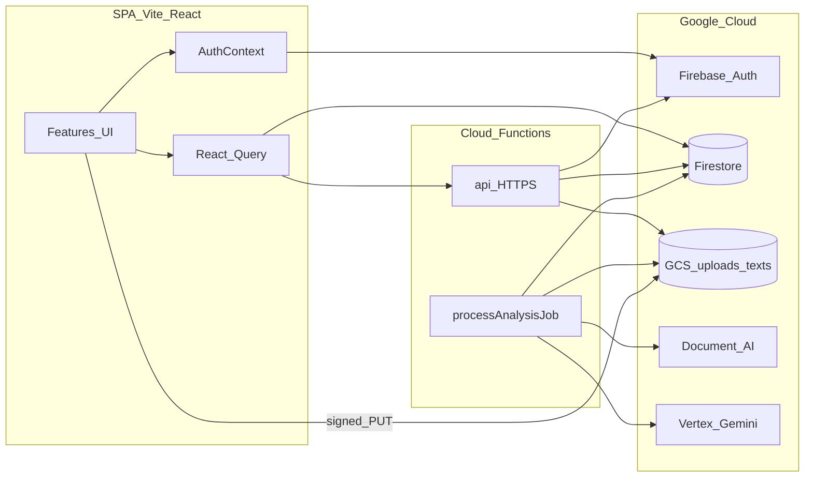
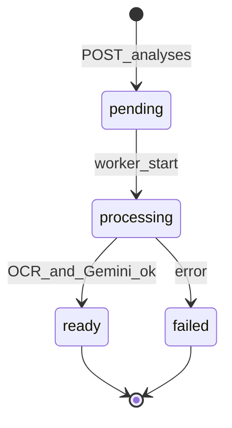

# Clario System Design

Clario is an AI legal-document analyzer: a React SPA talks to a Firebase-authenticated Cloud Functions BFF, which orchestrates GCS uploads, Document AI OCR, Vertex Gemini, and Firestore.

This document reflects the **current** frontend and backend after the architecture redesign (feature modules, quota, chat-by-id, async jobs, cleanup).

---

## 1. High-level architecture



| Layer | Responsibility |
|-------|----------------|
| SPA (`src/`) | Auth UX, upload, progress, dashboard, results, chat/negotiation UI |
| BFF (`functions` `api`) | AuthZ, quota, signed URLs, job enqueue, chat/negotiation by `analysisId`, delete |
| Worker (`processAnalysisJob`) | OCR → Gemini → mark analysis `ready` / `failed` |
| Firestore | Users, analyses, jobs, chat turns, negotiation state |
| GCS | Original uploads + extracted text objects |

---

## 2. Repository layout

```
/
├── src/                     # Browser app only
│   ├── app/                 # App shell, providers, routes
│   ├── features/
│   │   ├── auth/
│   │   ├── landing/
│   │   ├── analyze/         # upload + async analyze
│   │   ├── dashboard/
│   │   └── results/         # result, chat, negotiation
│   ├── shared/              # layouts, ProtectedRoute, AppHeader, UI states
│   └── lib/                 # firebase, apiClient, queryKeys, types, validation
├── functions/src/           # BFF + worker (TypeScript source of truth)
│   ├── http/ middleware/ routes/ services/ prompts/ workers/
│   └── index.ts             # exports api + processAnalysisJob
├── scripts/                 # ops (e.g. storage CORS)
├── config/                  # local GCP secrets (gitignored JSON)
├── firestore.rules
├── storage.rules
└── firebase.json            # hosting rewrite /api/** → api
```

Path aliases: `@/*`, `@app/*`, `@features/*`, `@shared/*`, `@lib/*`.

---

## 3. Frontend design

### 3.1 Routing and auth

- Public: `/`, `/auth` under `PublicLayout`
- Protected: `/analyzer`, `/dashboard`, `/results/:id` under `ProtectedRoute` + `AppLayout`
- Session: Firebase Auth via `AuthContext` (claims.admin → enterprise plan defaults)
- Server quota/plan fields preferred from Firestore `users/{uid}` when present

### 3.2 State model

| Concern | Mechanism |
|---------|-----------|
| Auth session | `AuthContext` |
| Analyses list/detail, quota, chat sessions | React Query (`queryKeys`) |
| Analyze progress | Local state in `useAnalyzeDocument` |
| UI (modals, forms) | Component `useState` |

### 3.3 Analyze flow (client)

1. Validate file (`lib/validation/file`)
2. Soft quota gate in UI (UX only)
3. `GET /api/storage/upload-url` → browser `PUT` to GCS
4. `POST /api/analyses` → `{ analysisId, jobId, status: pending }`
5. Poll Firestore `analyses/{id}` until `ready` or `failed`
6. Navigate to `/results/:id`; progress UX: uploading → queued → processing

### 3.4 Results: chat and negotiation

- **No client prompt builders** and **no `localStorage` history**
- Document chat: `POST /api/analysis/:id/chat` + session list/load APIs
- Negotiation: suggestions + advice by `analysisId` + `party`; state hydrated from BFF
- Server loads `gcsTextUri` text and builds prompts

### 3.5 Reads vs writes

- **Reads:** owner-scoped Firestore (`analyses`, `users`) allowed by rules
- **Writes/mutations:** BFF only (create job, delete, chat, negotiation)

---

## 4. Backend design

### 4.1 Cloud Functions

| Export | Type | Role |
|--------|------|------|
| `api` | HTTPS (`us-central1`) | Authenticated BFF router |
| `processAnalysisJob` | Firestore `onDocumentCreated` on `analysisJobs/{jobId}` | Async OCR + Gemini |

Every non-OPTIONS `api` request: verify Firebase ID token (`checkRevoked`) → sliding-window rate limit (`apiRateLimits/{uid}`).

### 4.2 HTTP API (current)

| Method | Path | Purpose |
|--------|------|---------|
| `GET` | `/api/storage/upload-url` | V4 signed write URL under `uploads/{uid}/` |
| `POST` | `/api/analyses` | Quota check → pending analysis + job |
| `DELETE` | `/api/analysis/:id` | Delete analysis + side data; adjust counters |
| `POST` | `/api/analysis/:id/chat` | Document Q&A; persist turns |
| `GET` | `/api/analysis/:id/chats` | Messages for session |
| `GET` | `/api/analysis/:id/chat-sessions` | Session summaries |
| `POST` | `/api/analysis/:id/negotiation/suggestions` | Party-scoped suggestions |
| `POST` | `/api/analysis/:id/negotiation/chat` | Negotiation advice |
| `GET` | `/api/analysis/:id/negotiation` | Saved party + suggestions |

**Removed legacy paths:** `/api/documentai/process`, `/api/ai/orchestrate`, `/api/analysis/persist` (sync pipeline replaced by jobs + chat-by-id).

### 4.3 Async job lifecycle



- Quota: `contractsAnalyzed + contractsInFlight < maxContracts` (admins skip)
- On create: `contractsInFlight++`
- On `ready`: `contractsAnalyzed++`, `contractsInFlight--`
- On `failed` / delete while in-flight: release `contractsInFlight`

### 4.4 Data model

| Collection | Client access | Notes |
|------------|---------------|-------|
| `users/{uid}` | read own | `plan`, `maxContracts`, `contractsAnalyzed`, `contractsInFlight` |
| `analyses/{id}` | read own | status + structured result + `gcsTextUri` |
| `analysisJobs/{jobId}` | deny | Worker queue |
| `analyses/{id}/chats/{msgId}` | read own | Document / negotiation messages |
| `analyses/{id}/negotiationState/current` | read own | Party + suggestions |
| `apiRateLimits/{uid}` | deny | BFF rate limit |

GCS: `uploads/{uid}/{uuid}-{filename}`, `texts/{uid}/{uuid}.txt`. Storage rules deny direct client access (signed URLs only).

### 4.5 Module map (`functions/src`)

- `http/` — router, errors, headers, request helpers  
- `middleware/` — auth, rateLimit  
- `routes/` — upload URL, analyses create, analysis delete, chat/negotiation  
- `services/` — gcs, documentAi, gemini, jobsRepo, analysesRepo, chatsRepo, usersRepo, analysisAccess  
- `prompts/` — analysis, chat, negotiation, schemas  
- `workers/` — processAnalysisJob  

---

## 5. Security summary

- Bearer ID token on all BFF routes
- GCS URIs constrained to configured bucket + `uploads|texts/{uid}/`
- Firestore: client cannot create/update/delete analyses or chats; Admin SDK only
- Storage: deny-all client rules
- Quota enforced on upload-url and job create (not UI-only)

---

## 6. Known follow-ons (not blockers)

- Per-route rate limits (cheap vs expensive) instead of one global window
- GCS lifecycle / retention for `uploads/` and `texts/`
- Billing provider for `pro` / `enterprise` beyond claims + `users.plan`
- Content-hash dedup or versioning for same-name uploads
- Optional `/api/v1` versioning when breaking the contract again
- Thinning large Landing/Auth presentational pages

---

## 7. Local and deploy notes

- Edit `functions/src` only; `npm run build --prefix functions` → deploy `functions/lib`
- Hosting: `vite build` → `firebase deploy --only hosting`
- Full backend: `firebase deploy --only firestore:rules,storage,functions`
- Secrets stay under `config/google-cloud/` (gitignored)
